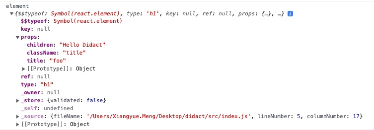

### 编译 JSX
在 `package.json` 文件中添加如下 dev 依赖并安装：
```json
  "devDependencies": {
    "@babel/cli": "^7.16.0",
    "@babel/core": "^7.16.0",
    "@babel/preset-react": "^7.16.0"
  }
```

添加 `babel.config.json` file,
```json
{
    "plugins": ["@babel/plugin-transform-react-jsx"]
}
```

使用 babel 编译 JSX, 在命令行运行：
```shell
./node_modules/.bin/babel src --out-dir lib
```
将在 lib 文件夹中看到输出后的的代码:  

转换前：
```js
import React from 'react';
import ReactDOM from 'react-dom';
import './index.css';

const element = <h1 title="foo" className="title">Hello Didact</h1>
ReactDOM.render(
  element,
  document.getElementById('root')
);

```

转换后：
```js
import React from 'react';
import ReactDOM from 'react-dom';
import './index.css';
const element = /*#__PURE__*/React.createElement("h1", {
  title: "foo",
  className: "title"
}, "Hello Didact");
ReactDOM.render(element, document.getElementById('root'));
```

element 值:


其中比较重要的是这些数据：
```js
const element = {
  type: "h1",
  props: {
    title: "foo",
    className: "title",
    children: "Hello Didact",
  },
}
​
```