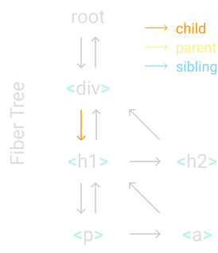

### 编译 JSX
在 `package.json` 文件中添加如下 dev 依赖并安装：
```json
  "devDependencies": {
    "@babel/cli": "^7.16.0",
    "@babel/core": "^7.16.0",
    "@babel/preset-react": "^7.16.0"
  }
```

添加 `babel.config.json` file,
```json
{
    "plugins": ["@babel/plugin-transform-react-jsx"]
}
```

使用 babel 编译 JSX, 在命令行运行：
```shell
./node_modules/.bin/babel src --out-dir lib
```
将在 lib 文件夹中看到输出后的的代码:  

转换前：
```js
import React from 'react';
import ReactDOM from 'react-dom';
import './index.css';

const element = <h1 title="foo" className="title">Hello Didact</h1>
ReactDOM.render(
  element,
  document.getElementById('root')
);

```

转换后：
```js
import React from 'react';
import ReactDOM from 'react-dom';
import './index.css';
const element = /*#__PURE__*/React.createElement("h1", {
  title: "foo",
  className: "title"
}, "Hello Didact");
ReactDOM.render(element, document.getElementById('root'));
```

element 值:


### 替换 `render` 方法
其中比较重要的是这些数据：
```js
const element = {
  type: "h1",
  props: {
    title: "foo",
    className: "title",
    children: "Hello Didact",
  },
}
​
```

将 `index.js` 中的 `element` 替换为上面的内容，然后运行在页面上会看到错误：
```
Error: Objects are not valid as a React child (found: object with keys {type, props}). If you meant to render a collection of children, use an array instead.
▶ 19 stack frames were collapsed.
Module.<anonymous>
src/index.js:14
  11 |     children: "Hello Didact",
  12 |   },
  13 | }
> 14 | ReactDOM.render(
  15 |   element,
  16 |   document.getElementById('root')
  17 | );
```

由于我们省略了许多字段，所以 `ReactDOM.render` 不能正常工作， 现在需要自己实现render功能。

```js
const container = document.getElementById("root")

const node = document.createElement(element.type)
node["title"] = element.props.title
node['className'] = element.props.className

const text = document.createTextNode("")
text["nodeValue"] = element.props.children

node.appendChild(text)
container.appendChild(node)
```

重新运行项目，能够看到结果输出跟原来是相同的。


## 新项目
修改 `index.js` 文件如下：
```js
import React from 'react';
import ReactDOM from 'react-dom';
import './index.css';

const element = (
  <div id="foo" className="title">
    <a>bar</a>
    <b />
  </div>
)
const container = document.getElementById("root")
ReactDOM.render(element, container)
```

运行 `./node_modules/.bin/babel src --out-dir lib`, 编译后文件内容如下，并使用其替换 `index.js`,
```js
import React from 'react';
import ReactDOM from 'react-dom';
import './index.css';
const element = /*#__PURE__*/React.createElement("div", {
  id: "foo",
  className: "title"
}, /*#__PURE__*/React.createElement("a", null, "bar"), /*#__PURE__*/React.createElement("b", null));
const container = document.getElementById("root");
ReactDOM.render(element, container);
```

目前还是能够正常运行。 

### 创建我们的 `createElement` 方法
在 `index.js` 文件中添加
```js
// 返回数据模型
function createElement(type, props, ...children) {
  return {
    type,
    props: {
      ...props,
      children,
    },
  }
}
```

由于 `children` 属性中可能含有字符串或者数字，对于这些需要进行特殊的处理，所以上面的代码需要修改为：
```js
function createElement(type, props, ...children) {
  return {
    type,
    props: {
      ...props,
      children: children.map(child => typeof child === 'object' ? child : createTextElement(child) )
    },
  }
}

function createTextElement(text) {
  return {
    type: 'TEXT_ELEMENT',
    props: {
      nodeValue: text,
      children: []
    }
  }
}
```

### 替换 React.createElement
为了让这个更像一个框架，我们给它起一个名字，并且替换为我们自己的 `createElement` 方法。
```js
const Didact = {
  createElement,
}
```

到目前为止 `index.js` 文件内容如下：
```js
import React from 'react';
import ReactDOM from 'react-dom';
import './index.css';


// 返回数据模型
function createElement(type, props, ...children) {
  return {
    type,
    props: {
      ...props,
      children: children.map(child => typeof child === 'object' ? child : createTextElement(child) )
    },
  }
}

function createTextElement(text) {
  return {
    type: 'TEXT_ELEMENT',
    props: {
      nodeValue: text,
      children: []
    }
  }
}

const Didact = {
  createElement,
}

const element = /*#__PURE__*/Didact.createElement("div", {
  id: "foo",
  className: "title"
}, /*#__PURE__*/Didact.createElement("a", null, "bar"), /*#__PURE__*/Didact.createElement("b", null));
const container = document.getElementById("root");
ReactDOM.render(element, container);
```
> check tag: 1.0-create-our-won-element


### 配置 JSX 调用我们的 createElement
替换
```js
const element = /*#__PURE__*/Didact.createElement("div", {
  id: "foo",
  className: "title"
}, /*#__PURE__*/Didact.createElement("a", null, "bar"), /*#__PURE__*/Didact.createElement("b", null));
```
为：
```js
/** @jsx Didact.createElement */
const element = (
  <div id="foo" className="title">>
    <a>bar</a>
    <b />
  </div>
)
```
> `@jsx Didact.createElement` 告诉 babel 使用 `Didact.createElement` 转换 JSX

运行 `./node_modules/.bin/babel src --out-dir lib`, 然后查看 `lib/index.js` 能够发现已经调用了我们写的方法了

> check tag: 1.1-jsx-config

### 重写 `Render` 方法
到目前为止项目是无法运行的，错误在上面有。

```js
function render(element, container) {
  // 根据配置创建 HTML node, 如果 type 是 TEXT_ELEMENT 需要特殊处理
  const dom = element.type == "TEXT_ELEMENT" 
    ? document.createTextNode("")
    : document.createElement(element.type)
  
  // 获取除 children 以外的所有的属性，并将其赋值给新创建的 HTML node
  Object.keys(element.props)
    .filter(key => key !== "children")
    .forEach(name => {
      dom[name] = element.props[name]
    })
  
  // 递归创建 HTML node
  element.props.children.forEach(child => render(child, dom) )

  // 将创建的 node 添加到 container node 上
  container.appendChild(dom)
}

const Didact = {
  createElement,
  // 并将 render 方法配置到这里
  render 
}
```

替换 `React.render(element, container);` 为 `Didact.render(element, container);`。

这时候需要在 `index.js` 文件的 `import xxxxx` 之前加入 `/** @jsxRuntime classic */`。 
> `@jsxRuntime classic` 解释:  
> https://blog.csdn.net/qq_41801117/article/details/119464218
重新运行代码，能够看到形同的输出


> check tag: 1.2-create-our-own-render-method

### 并发渲染
目前代码是能够运行，但是有一个问题，每次渲染开始后必须渲染完所有的节点后，才会让出主线程的控制权。如果这时候有一些高优先级的任务需要执行，必须等待渲染完成。

我们可以利用 `requestIdleCallback` 方法，每隔一段时间把CPU的控制权还给浏览器，需要实现这个方式，需要将渲染任务拆成许多的子任务。

```js
// 需要执行的任务
let nextUnitWOfWork = null;

// 执行任务的循环 每一次调用的时候设置 执行时间
function workLoop(deadline) {
  let shouldYield = false
  while (nextUnitWOfWork && !shouldYield) {
    nextUnitWOfWork = performUnitOfWork(nextUnitWOfWork)
    shouldYield = deadline.timeRemaining() < 1
  }
  requestIdleCallback(workLoop)
}

// 在主线程空闲的时候 回调我们传入的方法
requestIdleCallback(workLoop)

// 执行一个任务 并且返回后续需要执行的任务
function performUnitOfWork(nextUnitOfWork) {

}
```
> check tag: 1.2-concurrent-render

### Fibers
参考文章   
1. [https://zhuanlan.zhihu.com/p/26027085](https://zhuanlan.zhihu.com/p/26027085)
2. [https://segmentfault.com/a/1190000018250127](https://segmentfault.com/a/1190000018250127)

考虑我们又如下的节点：
```html
  <div>
    <h1>
      <p />
      <a />
    </h1>
    <h2 />
  </div>
```
生成的Fiber 如下，



每一个节点是一个Fiber，每一次渲染一个Fiber。渲染的规则是
1. 如果有 child，渲染child
2. 如果没有child，渲染 sibling 
3. 没有child 和 sibling 返回父节点，继续后面的操作。

按照目前的例子节点，渲染顺序为： `div->h1->p->a->h2`

创建 `createDom` 方法，让其只是负责渲染一个Fiber（代码基本都是从render复制的）：
```js
function createDom(fiber) {
  // 根据配置创建 HTML node, 如果 type 是 TEXT_ELEMENT 需要特殊处理
  const dom = fiber.type === "TEXT_ELEMENT" 
    ? document.createTextNode("")
    : document.createElement(fiber.type)
  
  // 获取除 children 以外的所有的属性，并将其赋值给新创建的 HTML node
  Object.keys(fiber.props)
    .filter(key => key !== "children")
    .forEach(name => {
      dom[name] = fiber.props[name]
    })
  
  return dom  
}
```

修改 `render` 代码, 只是负责启动渲染。
```js
function render(element, container) {
  nextUnitWOfWork = {
    dom: container,
    props: {
      children: [element]
    }
  }
}
```

组织渲染任务
```js
// 执行一个任务 并且返回后续需要执行的任务
function performUnitOfWork(fiber) {
  //1. 如果 fiber dom 不存在，则创建HTML node
  if (!fiber.dom) {
    fiber.dom = createDom(fiber)
  }

  //2. 如果其有 parent，需要将其添加到父节点
  if (fiber.parent) {
    fiber.parent.dom.appendChild(fiber.dom)
  }

  //3. 创建新的fibers
  const elements = fiber.props.children
  let index = 0;
  let prevSibling = null

  // 构建当前fiber 和其子 fiber 的关系
  while (index < elements.length) {
    const element = elements[index]

    const newFiber = {
      type: element.type,
      props: element.props,
      parent: fiber,
      dom: null
    }

    // 将根据children创建的第一个fiber，设置为当前fiber的child
    if (index == 0) {
      fiber.child = newFiber
    } else {
      // 将 new fiber 设置为上一个fiber 的 sibling
      prevSibling.sibling = newFiber
    }
    prevSibling = newFiber
    index++
  }
  // 4. 返回后续需要执行的任务
  if (fiber.child) {
    return fiber.child
  }
  let nextFiber = fiber
  // 寻找当前fiber及其父fiber路径上面的姊妹fiber，当运行到这里的时候，一定是到达了root到该fiber路径的叶子fiber
  while (nextFiber) {
    if (nextFiber.sibling) {
      return nextFiber.sibling
    }
    nextFiber = nextFiber.parent
  }
}
```
> check tag: 1.3-fiber-render

### Render 和 提交阶段
目前每次创建一个 node 就添加到当前的页面的 DOM 中，但是浏览器可能会打断这个过程，这时候用户就会看到不完整的UI，这个不是我们希望的，所以我们希望在所有的 node 都创建好了后，同时更新到当前的页面中。

删除 `function performUnitOfWork(fiber)` 的如下代码：
```js
  if (fiber.parent) {
    fiber.parent.dom.appendChild(fiber.dom)
  }
```

同时创建 `wipRoot` 记录当前正在渲染的 fiber, 并修改 `render` 方法。
```js
function render(element, container) {
  wipRoot = {
    dom: container,
    props: {
      children: [element]
    }
  }
  nextUnitWOfWork = wipRoot
}

// 需要执行的任务
let nextUnitWOfWork = null;
let wipRoot = null;
```

最后需要在所有的任务都完成后提交所有的node, 修改 `function workLoop(deadline)` 方法如下：
```js
// 执行任务的循环 每一次调用的时候设置 执行时间
function workLoop(deadline) {
  let shouldYield = false
  while (nextUnitWOfWork && !shouldYield) {
    nextUnitWOfWork = performUnitOfWork(nextUnitWOfWork)
    shouldYield = deadline.timeRemaining() < 1
  }
  //-------------------------new add start--------------------
  // 如果没有后续的任务了 提交
  if (!nextUnitWOfWork && wipRoot) {
    commitRoot()
  }
  //-------------------------new add end--------------------
  requestIdleCallback(workLoop)
}
```

添加方法：
```js
function commitRoot() {

}
```